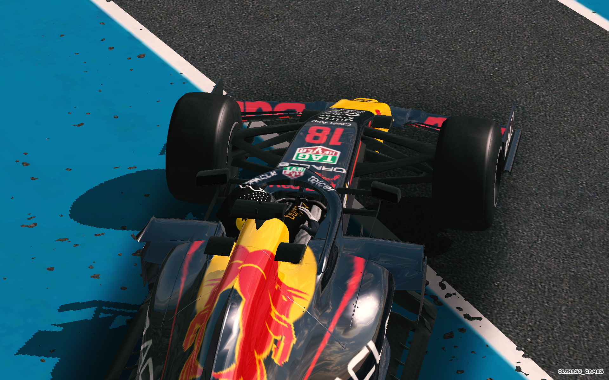

/*event example*/
.card-e-art{
  color: var(--color-white);
  padding: 20px;
  background: white;
}
.card-e-art-v{
  margin: 0;
}
.card-e-art-v img{
  display: block;
width: 100%;
height:auto;
object-fit:cover
}
.card-e-art-overlay{
  position: absolute;
  top: 0; left: 0; right: 0; bottom: 0;
  display: flex;
  flex-direction: column;
  justify-content: flex-end; /* text sits bottom by default */
  align-items: center;       /* center horizontally */
  padding: 5px !important;
  background: var(--color-transparent);
  backdrop-filter: blur(24px) saturate(180%);
  mask: linear-gradient(
    to bottom,
    #00000000 0%,
    rgba(255, 255, 255, 0) 35%,
    rgba(255, 255, 255, 0) 50%,
    rgba(207, 197, 197, 0) 65%,
    #000000e3 100%
)

}

.card-e-art-tittle{
  position:absolute;

    left:18px;
    right:8px;
    bottom:8px;

    display:flex;
    flex-direction:column;
    z-index:2;

}

.articlee-tittle{

}

.card-e-art-gs{
  background: rgb(64, 64, 64);
}
.card-e-art-v{
  position: relative;
  overflow: hidden;
}

<section>
  <article class="card-e-art">
    

      
      

      

      <article class="card-e-art-tittle">
        <h3>Track day</h3>
      </article>
      
    

    

      hi
          <button>discover</button>
    

  </article>
</section>

.hero-texte{
  
  position: absolute;
  color: var(--color-white);
  top: 55%;
  left: 60%;
  z-index: 5;
}

.hero-textn{
  position: absolute;
  font-size: .4rem;
  top: 55%;
  left: 63%;
  font-family: Gustavo, sans-serif;
  font-display: swap;
  font-style: italic;
  color: var(--color-white);
  text-transform: uppercase;
  z-index: 2;
}
.hero-textm{
  position: absolute;
  font-size: .5rem;
  top: 57%;
  left: 63%;
  font-family: Gustavo, sans-serif;
  font-display: swap;
  font-style: italic;
  color: rgb(255, 159, 23);
  text-transform: uppercase;
  z-index: 2;
}

@media (max-width: 640px) {
  .hero-texte{
  
  position: absolute;
  color: var(--color-white);
  top: 55%;
  left: 60%;
  z-index: 5;
}

.hero-textn{
  position: absolute;
  font-size: .4rem;
  top: 55%;
  left: 63%;
  font-family: Gustavo, sans-serif;
  font-display: swap;
  font-style: italic;
  color: var(--color-white);
  text-transform: uppercase;
  z-index: 2;
}
.hero-textm{
  position: absolute;
  font-size: .5rem;
  top: 57%;
  left: 63%;
  font-family: Gustavo, sans-serif;
  font-display: swap;
  font-style: italic;
  color: rgb(255, 159, 23);
  text-transform: uppercase;
  z-index: 2;
}
  
}